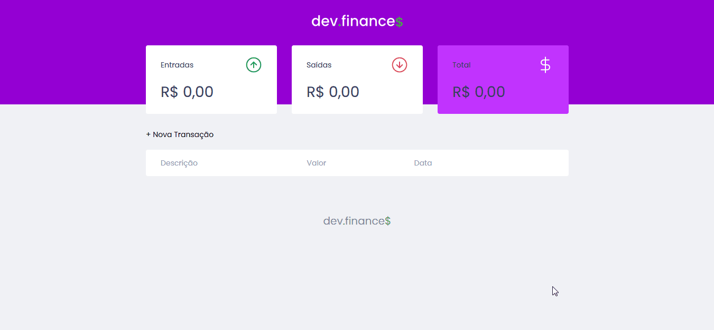

<h1 align="center">
    
</h1>

<h1>
    
</h1>

## 📃 Sobre

O projeto **Dev Finance** é uma carteira virtual que foi criada dentro da **Maratona Discover** oferecida pela **Rocketseat** gratuitamente, que foi ministrado pelo professor Mayk Brito com o objetivo de ensinar iniciantes na programação.

---

## 🚀 Tecnologias utilizadas

O projeto foi desenvolvido com as seguintes tecnologias:

- HTML
- CSS
- JS

--- 

## 📁 Como baixar o projeto

```bash

    # Clonar o repositório
    $ git clone https://github.com/EnzoXavier1001/Maratona-Discover

    # Entrar no diretório
    $ cd Maratona-Discover

```


